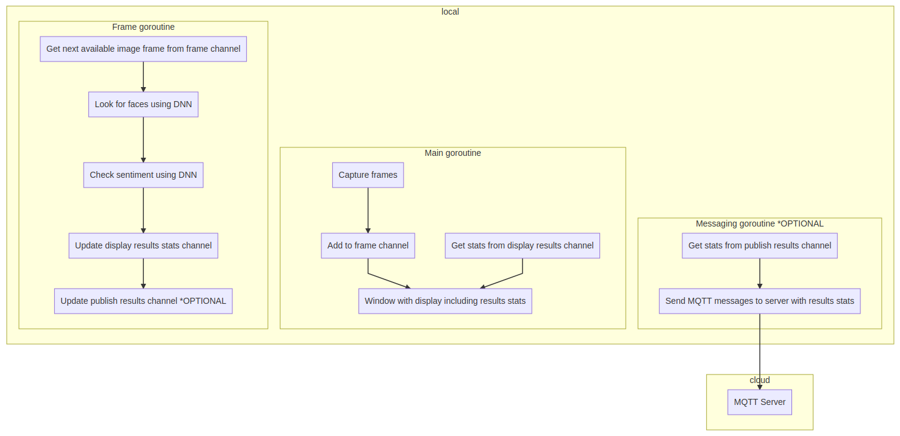

# Shopper Mood Monitor

| Details            |              |
|-----------------------|---------------|
| Target OS:            |  Ubuntu\* 16.04 LTS   |
| Programming Language: |  Go |
| Time to Complete:    |  45 min     |


## Introduction

This shopper mood monitor application is one of a series of reference implementations for Computer Vision (CV) using the Intel® Distribution of OpenVINO™ toolkit. This application is designed for a retail shelf mounted camera system that counts the the number of passers-by that look toward the display to capture their mood which is classified into 5 emotions:

- Neutral
- Happy
- Sad
- Surprised
- Anger

If the emotion can't be determined with a level of confidence higher than the value configurable via command line parameter, the emotion is marked as Unknown.

It is intended to provide real-world marketing statistics for in-store shopping mood analysis.

## Requirements

### Hardware
* 6th Generation Intel® Core™ processor with Intel® Iris® Pro graphics and Intel® HD Graphics

### Software
* [Ubuntu\* 16.04 LTS](http://releases.ubuntu.com/16.04/)
*Note*: You must be running kernel version 4.7+ to use this software. We recommend using a 4.14+ kernel to use this software. Run the following command to determine your kernel version:

```shell
uname -a
```

* OpenCL™ Runtime Package
* Intel® Distribution of OpenVINO™ toolkit

Go programming language requirements here...

## Setup

### Install OpenVINO™ Toolkit
Refer to https://software.intel.com/en-us/articles/OpenVINO-Install-Linux for more information about how to install and setup the Intel® Distribution of OpenVINO™ toolkit.

You will need the OpenCL™ Runtime package if you plan to run inference on the GPU as shown by the
instructions below. It is not mandatory for CPU inference.

## How it Works

The application uses a video source, such as a camera, to grab frames, and then uses 2 different Deep Neural Networks (DNNs) to process the data. The first network looks for faces, and then if successful is counted as a "shopper"

A second neural network is then used to determine the emotion for each detected face if the person's head is facing towards the camera.

The data can then optionally be sent to a MQTT machine to machine messaging server, as part of a retail data analytics system.

The DNN models used are Intel® optimized models that are part of the Intel® Distribution of OpenVINO™ toolkit.

You can find them here:

- `/opt/intel/computer_vision_sdk/deployment_tools/intel_models/face-detection-adas-0001`
- `/opt/intel/computer_vision_sdk/deployment_tools/intel_models/emotions-recognition-retail-0003`



The program creates three go routines for concurrency:

- Main goroutine that performs the video i/o
- Goroutine that processes video frames using the deep neural networks
- Goroutine that publishes any MQTT messages

## Setting the Build Environment

You must configure the environment to use the Intel® Distribution of OpenVINO™ toolkit one time per session by running the following command:

```shell
source /opt/intel/computer_vision_sdk/bin/setupvars.sh
```

## Building the Code

Start by changing the current directory to wherever you have git cloned the application code. For example:

```shell
cd shopper-mood-monitor-go
```

Before you can build the program you need to fetch its dependencies. You can do that by running the commands below. The first one fetches `Go` depedency manager of our choice and the latter uses it to satisfy the program's depdencies as defined in `Gopkg.lock` file:

```shell
make godep
make dep
```

Once you have fetched the dependencies you must export a few environment variables required to build the library from the fetched dependencies. Run the following command from the project directory:

```shell
source vendor/gocv.io/x/gocv/openvino/env.sh
```

Now you are ready to build the program binary. The project ships a simple `Makefile` which makes building the program easy by invoking the `build` task from the project root as follows:

```shell
make build
```

This commands creates a new directory called `build` in your current working directory and places the newly built binary called `monitor` into it.

## Running the Code

To see a list of the various options:

```shell
./build/monitor -h
```

To run the application with the needed models using the webcam:

```shell
./build/monitor -face-model=/opt/intel/computer_vision_sdk/deployment_tools/intel_models/face-detection-adas-0001/FP32/face-detection-adas-0001.bin -face-config=/opt/intel/computer_vision_sdk/deployment_tools/intel_models/face-detection-adas-0001/FP32/face-detection-adas-0001.xml -sent-model=/opt/intel/computer_vision_sdk/deployment_tools/intel_models/emotions-recognition-retail-0003/FP32/emotions-recognition-retail-0003.bin -sent-config=/opt/intel/computer_vision_sdk/deployment_tools/intel_models/emotions-recognition-retail-0003/FP32/emotions-recognition-retail-0003.xml
```

The user can choose different confidence levels for both face and emotion detection by using `-face-confidence` and `-sent-confidence`. command line parameters. By default, both of these parameters are set to `0.5` i.e. at least `50%` confidence is required in order for the returned inference result to be considered valid.

### Docker

You can also build a Docker image and then run the program in a Docker container. First you need to build the image. You can use the `Dockerfile` present in the cloned repository and build the Docker image by running the following command:

```shell
docker build -t shopper-mood-go .
```

This will produce a docker image called `shopper-mood-go` which contains the built binary. Since the built docker image has an [ENTRYPOINT](https://docs.docker.com/engine/reference/builder/#entrypoint) defined you can run the image as an executable using the following command:

```shell
docker run -it --rm shopper-mood-go -h
```

### Azure

If you'd like to know how you can take advantage of more advanced build system provided by [Microsoft Azure Cloud](https://azure.microsoft.com/), please check out the Azure guide [here](./azure.md). Following the steps in the guide you can build a Docker container and push it into Azure Container Registry to make it available online.

### Hardware Acceleration

This application can take advantage of the hardware acceleration in the Intel® Distribution of OpenVINO™ toolkit by using the `-backend, -b` and `-target, -t` parameters.

For example, to use the Intel® Distribution of OpenVINO™ toolkit backend with the GPU in 32-bit mode you need to set the `-backend` flag to `2` and `-target` flag to `1`:

```shell
./build/monitor -face-model=/opt/intel/computer_vision_sdk/deployment_tools/intel_models/face-detection-adas-0001/FP32/face-detection-adas-0001.bin -face-config=/opt/intel/computer_vision_sdk/deployment_tools/intel_models/face-detection-adas-0001/FP32/face-detection-adas-0001.xml -sent-model=/opt/intel/computer_vision_sdk/deployment_tools/intel_models/emotions-recognition-retail-0003/FP32/emotions-recognition-retail-0003.bin -sent-config=/opt/intel/computer_vision_sdk/deployment_tools/intel_models/emotions-recognition-retail-0003/FP32/emotions-recognition-retail-0003.xml -backend=2 -target=1
```

To run the code using 16-bit floats, you have to both set the `-target` flag to use the GPU in 16-bit mode, as well as use the FP16 version of the Intel® models:

```shell
./build/monitor -face-model=/opt/intel/computer_vision_sdk/deployment_tools/intel_models/face-detection-adas-0001/FP16/face-detection-adas-0001.bin -face-config=/opt/intel/computer_vision_sdk/deployment_tools/intel_models/face-detection-adas-0001/FP16/face-detection-adas-0001.xml -sent-model=/opt/intel/computer_vision_sdk/deployment_tools/intel_models/emotions-recognition-retail-0003/FP16/emotions-recognition-retail-0003.bin -sent-config=/opt/intel/computer_vision_sdk/deployment_tools/intel_models/emotions-recognition-retail-0003/FP32/emotions-recognition-retail-0003.xml -backend=2 -target=2
```

To run the code using the VPU, you have to set the `-target` flag to `3` and also use the 16-bit FP16 version of the Intel® models:

```shell
./build/monitor -face-model=/opt/intel/computer_vision_sdk/deployment_tools/intel_models/face-detection-adas-0001/FP16/face-detection-adas-0001.bin -face-config=/opt/intel/computer_vision_sdk/deployment_tools/intel_models/face-detection-adas-0001/FP16/face-detection-adas-0001.xml -sent-model=/opt/intel/computer_vision_sdk/deployment_tools/intel_models/emotions-recognition-retail-0003/FP16/emotions-recognition-retail-0003.bin -sent-config=/opt/intel/computer_vision_sdk/deployment_tools/intel_models/emotions-recognition-retail-0003/FP32/emotions-recognition-retail-0003.xml -backend=2 -target=3
```

## Sample videos

There are several videos available to use as sample videos to show the capabilities of this application. You can download them by running these commands from the `shopper-mood-monitor-go` directory:

```shell
mkdir resources
cd resources
wget https://github.com/intel-iot-devkit/sample-videos/raw/master/face-demographics-walking-and-pause.mp4
wget https://github.com/intel-iot-devkit/sample-videos/raw/master/face-demographics-walking.mp4
cd ..
```

To then execute the code using one of these sample videos, run the following commands from the `shopper-mood-monitor-go` directory:

```shell
./build/monitor -face-model=/opt/intel/computer_vision_sdk/deployment_tools/intel_models/face-detection-adas-0001/FP32/face-detection-adas-0001.bin -face-config=/opt/intel/computer_vision_sdk/deployment_tools/intel_models/face-detection-adas-0001/FP32/face-detection-adas-0001.xml -sent-model=/opt/intel/computer_vision_sdk/deployment_tools/intel_models/emotions-recognition-retail-0003/FP32/emotions-recognition-retail-0003.bin -sent-config=/opt/intel/computer_vision_sdk/deployment_tools/intel_models/emotions-recognition-retail-0003/FP32/emotions-recognition-retail-0003.xml -input=./resources/face-demographics-walking-and-pause.mp4
```

### Machine to Machine Messaging with MQTT

If you wish to use a MQTT server to publish data, you should set the following environment variables before running the program:

```shell
export MQTT_SERVER=tcp://localhost:1883
export MQTT_CLIENT_ID=shopper123
```

*Note:* You must always specify the server protocol -- the above example is using `TCP` protocol.

Change the `MQTT_SERVER` to a value that matches the MQTT server you are connecting to.

You should change the `MQTT_CLIENT_ID` to a unique value for each monitoring station, so you can track the data for individual locations. For example:

```shell
export MQTT_CLIENT_ID=hopper123
```

If you want to monitor the MQTT messages sent to your local server, and you have the `mosquitto` client utilities installed, you can run the following command:

```shell
mosquitto_sub -t 'retail/traffic'
```
